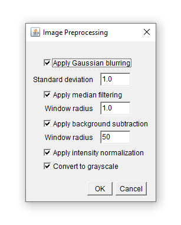
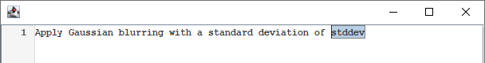
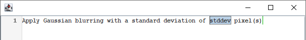
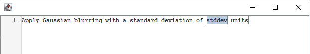
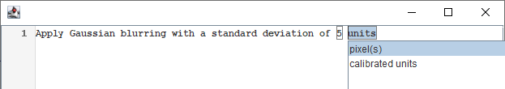

<link href='https://fonts.googleapis.com/css?family=Caveat' rel='stylesheet'>
<link rel="stylesheet" href="css/github-markdown.css">
<link rel="stylesheet" href="css/projects.css">
<link rel="stylesheet" href="css//intellij-light.min.css">
<script src="js/highlight-11.6.0.min.js"></script>
<script>
function showDialog(id) {
  document.getElementById(id).showModal();
  document.documentElement.style.overflowY = 'hidden';
  return false; // to disable href
}

function hideDialog(id)  {
  document.getElementById(id).close();
  document.documentElement.style.overflowY = '';
  return false; // to disable href
}
</script>
<style>
.markdown-body h1 {
  font-family: 'Caveat';
  font-size: 40;
  background-color: #183d3d;
  color: white;
  padding: 40px;
}

.markdown-body h2 {
  margin-top: 3em;
}

.markdown-body img {
  margin: 50px;
}

/*
table {
  width:100%;
}
table td {
  padding-top: 1em;
  padding-bottom: 1em;
}
*/

dialog {
  max-width: 800px;
  max-height: calc(100vh - 150px);
  overflow-y: auto;
  border-width: 0px;
  box-shadow: 0px 0px 15px;
}

dialog::backdrop {
  background-color: #000000a0;
}

details summary {
  display: block;
}

.content {
  background-color: #f5f5f5;
  margin: 1em;
  margin-right: 0px;
  padding: 10px;
  padding-bottom: 1px;
  font-size: smaller;
  border-radius: 5px;
}

@keyframes details-show {
  from {
    opacity:0;
    transform: var(--details-translate, translateY(-0.5em));
  }
}

details[open] > *:not(summary) {
  animation: details-show 150ms ease-in-out;
}

/*
table th:first-of-type {
  width:20%
}
table th:nth-of-type(2) {
  width:10%
}
table th:nth-of-type(3) {
  width:40%
}
table th:nth-of-type(4) {
  width:30%
}
*/

</style>


# Natural Language Scripting: A first tutorial<br> Image Pre-processing

## Why use a natural scripting interface
Graphical user interfaces can easily become complex and confusing as the number of user input parameters increases. This is particularly true if a workflow needs to be configured, where (i) each step has its own set of parameters, (ii) steps can occur in any order and (iii) steps can be repeated arbitrarily. Consider the configuration of an image pre-processing workflow, which consists of the following algorithms, each having its own set of parameters:
- Gaussian blurring (standard deviation)
- Median filtering (window radius)
- Background subtraction (window radius)
- Conversion to grayscale
- Intensity normalization

A traditional graphical user interface (GUI) could e.g. look like this:



where the user can activate the various algorithms and specify their parameters as necessary. This user interface however does not take into account that different algorithms could occur repeatedly, and it does not allow to change the order.

Using Natural Language Scripting, we want to implement a text-based interface which reads and executes text like:
```bash
Apply Gaussian blurring with a standard deviation of 3 pixel(s).
Subtract the background with a window readius of 30 pixel(s).
Apply Median filtering with a window radius of 1 pixel(s).
Normalize intensities.
Apply Gaussian blurring with a standard deviation of 1 pixel(s).
```

## Create the backend
First of all, we'll implement a backend which does the actual processing. We therefore create a class that implements the actual algorithms. It uses Fiji as an underlying image processing library:
<details><summary><b>Preprocessing.java</b></summary>
<pre><code>import ij.IJ;
import ij.ImagePlus;
import ij.process.ImageProcessor;

public class Preprocessing {

	private ImagePlus image;

	public Preprocessing(ImagePlus image) {
		this.image = image;
	}

	public void gaussianBlur(float stdDev) {
		IJ.run(image, "Gaussian Blur...", "sigma=" + stdDev);
	}

	public void medianFilter(int radius) {
		IJ.run(image, "Median...", "radius=" + radius);
	}

	public void subtractBackground(float radius) {
		IJ.run(image, "Subtract Background...", "rolling=50");
	}

	public void convertToGray() {
		if(image.getType() == ImagePlus.COLOR_RGB)
			IJ.run(image, "8-bit", "");
	}

	public void intensityNormalization() {
		convertToGray();
		ImageProcessor ip = image.getProcessor();
		double min = ip.getMin();
		double max = ip.getMax();
		ip = ip.convertToFloat();
		ip.subtract(min);
		ip.multiply(1 / (max - min));
		image.setProcessor(ip);
	}
}
</code></pre>
</details>


## Implement an interface that understands a first sentence
The Natural Language Scripting framework offers a convenient way to define the sentences your interface should understand, and provides an auto-completion enabled text editor for users to enter their instructions. The following code snippet shows how to create a parser, how to define a pattern for a sentence for it to parse, and how to display the editor:
```java
Parser parser = new Parser();
parser.defineSentence(
    "Apply Gaussian blurring with a standard deviation of {stddev:float} pixel(s).",
    null);

new ACEditor(parser).setVisible(true);
```
Find the full code [here](https://github.com/nlScript/nlScript-tutorial-java/blob/main/src/main/java/de/nlScript/tutorial/preprocessing/Tutorial01.java).

In this example we state that we expect a literal "Apply Gaussian blurring with a standard deviation of ", followed by a floating point number, which we name "stddev" for later reference, followed by the literal "pixel(s).". There is a second parameter to `defineSentence()`, which we'll discover next.

The code snippet is sufficient to provide the means for user input, but nothing happens yet when the user clicks the `Run` button.

Find more information about <a href="variables.html" target="_blank">How to specify variables</a>.


## Evaluating the parsed text
The second argument to `parser.defineSentence()`, which was set to `null` above, is of type `Evaluator`. `Evaluator` is an interface with a single function
```
interface Evaluator {
   Object evaluate(ParsedNode pn); 
}
```
The task of the evaluator is to evaluate the expression (the sentence) we defined on the parser. In the example, it is responsible for the actual blurring. The argument to `evaluate()`, `pn`, is of type `ParsedNode`, which can be used to retrieve the parsed value for the standard deviation.

Variables in NLS are defined hierarchically (see the paragraph "Custom types and type hierarchy" below). The result of parsing is also a hierarchical tree-like structure consisting of nodes of type `ParsedNode`. The `ParsedNode` has child `ParsedNode`s representing the variables the current type consists of. The sentence above consists of a string literal "Apply Gaussian blurring with a standard deviation of", a variable of type `double` called "stddev", and a string literal "pixel(s).". Therefore, the `ParsedNode` given to the sentence's `Evaluator` has three child `ParsedNode`s, which can be accessed, e.g. by name, in the `Evaluator` and evaluated recursively.

```java
Preprocessing preprocessing = new Preprocessing();
Parser parser = new Parser();
parser.defineSentence(
    "Apply Gaussian blurring with a standard deviation of {stddev:float} pixel(s).",
    pn -> {
        double stdDev = (double)pn.evaluate("stddev");
        preprocessing.gaussianBlur((float)stdDev);
        return null;
    });

new ACEditor(parser).setVisible(true);
```

Find the full code [here](https://github.com/nlScript/nlScript-tutorial-java/blob/main/src/main/java/de/nlScript/tutorial/preprocessing/Tutorial02.java).

This is the first fully working example:

<video style="margin: auto; display: block;" width="800" controls>
  <source src="images/2023-09-07-13-11-46.cropped.mp4" type="video/mp4">
</video>


## Built-in types
Above, we specified the type of the standard deviation parameter `stddev` to be a floating point number, using `{stddev:float}`.

The following tables show other available built-in types:

<div>

<details>
<summary><code>int</code>: An integral number</summary>
<div class="content">
<p><em>Example:</em> <code>{page:int}</code> Defines a parameter 'page' as an integral number.</p>
<p><em>Parses e.g.: </em><code>5</code></p>
<p><em>Evaluates to: </em><code>java.lang.Integer</code></p>
</div>
</details>

<details>
<summary><code>float</code>: A floating-point number</summary>
<div class="content">
<p><em>Example: </em><code>{sigma:float}</code> Defines a parameter 'sigma' as a floating-point number.
<p><em>Parses e.g.: </em><code>5.3</code></p>
<p><em>Evaluates to: </em><code>java.lang.Double</code></p>
</div>
</details>

<details>
<summary><code>digit</code>: A character from '0' to '9'</summary>
<div class="content">
<p><em>Example: </em><code>{ch:digit}</code> Defines a parameter 'ch' as a digit.
<p><em>Parses e.g.: </em><code>3</code></p>
<p><em>Evaluates to: </em><code>java.lang.Character</code></p>
</div>
</details>

<details>
<summary><code>letter</code>: A character A-Z or a-z</summary>
<div class="content">
<p><em>Example: </em><code>{ch:letter}</code> Defines a parameter 'ch' as a letter.
<p><em>Parses e.g.: </em><code>b</code></p>
<p><em>Evaluates to: </em><code>java.lang.Character</code></p>
</div>
</details>

<details>
<summary><code>path</code>: A path within the local file system</summary>
<div class="content">
<p><em>Example: </em><code>{inputfile:path}</code> Defines a parameter 'inputfile' as a file system path.
<p><em>Parses e.g.: </em><code>'C:\Program Files'</code></p>
<p><em>Evaluates to: </em><code>java.lang.String</code></p>
</div>
</details>

<details>
<summary><code>color</code>: A color</summary>
<div class="content">
<p><em>Example: </em><code>{text-color:color}</code> Defines a parameter 'text-color' as a color.
<p><em>Parses e.g.: </em><code>(25, 0, 233)</code> as an RGB value or one of the pre-defined colors below.</p>
<p><em>Evaluates to: </em><code>int</code> representing the RGB value of the color. Conversion between <code>int</code> and <code>java.awt.Color</code> is possible using <code>new Color(int)</code> and <code>Color.toRGB()</code>.</p>
<p>Pre-defined colors:</p>
<ul>
<li><span style="background-color: rgb(0, 0, 0);       width: 1em; display: inline-block; height: 0.6em; border: black solid 1px;"></span>  black (0, 0, 0)
<li><span style="background-color: rgb(255, 255, 255); width: 1em; display: inline-block; height: 0.6em; border: black solid 1px;"></span>  white (255, 255, 255)
<li><span style="background-color: rgb(255, 0, 0);     width: 1em; display: inline-block; height: 0.6em; border: black solid 1px;"></span>  red (255, 0, 0)
<li><span style="background-color: rgb(255, 128, 0);   width: 1em; display: inline-block; height: 0.6em; border: black solid 1px;"></span>  orange (255, 128, 0)
<li><span style="background-color: rgb(255, 255, 0);   width: 1em; display: inline-block; height: 0.6em; border: black solid 1px;"></span>  yellow (255, 255, 0)
<li><span style="background-color: rgb(128, 255, 0);   width: 1em; display: inline-block; height: 0.6em; border: black solid 1px;"></span>  lawn green (128, 255, 0)
<li><span style="background-color: rgb(0, 255, 0);     width: 1em; display: inline-block; height: 0.6em; border: black solid 1px;"></span>  green (0, 255, 0)
<li><span style="background-color: rgb(0, 255, 180);   width: 1em; display: inline-block; height: 0.6em; border: black solid 1px;"></span>  spring green (0, 255, 180)
<li><span style="background-color: rgb(0, 255, 255);   width: 1em; display: inline-block; height: 0.6em; border: black solid 1px;"></span>  cyan (0, 255, 255)
<li><span style="background-color: rgb(0, 128, 255);   width: 1em; display: inline-block; height: 0.6em; border: black solid 1px;"></span>  azure (0, 128, 255)
<li><span style="background-color: rgb(0, 0, 255);     width: 1em; display: inline-block; height: 0.6em; border: black solid 1px;"></span>  blue (0, 0, 255)
<li><span style="background-color: rgb(128, 0, 255);   width: 1em; display: inline-block; height: 0.6em; border: black solid 1px;"></span>  violet (128, 0, 255)
<li><span style="background-color: rgb(255, 0, 255);   width: 1em; display: inline-block; height: 0.6em; border: black solid 1px;"></span>  magenta (255, 0, 255)
<li><span style="background-color: rgb(255, 0, 128);   width: 1em; display: inline-block; height: 0.6em; border: black solid 1px;"></span>  pink (255, 0, 128)
<li><span style="background-color: rgb(128, 128, 128); width: 1em; display: inline-block; height: 0.6em; border: black solid 1px;"></span>  gray (128, 128, 128)
</ul>
</div>
</details>

<details>
<summary><code>weekday</code>: Day of the week</summary>
<div class="content">
<p><em>Example: </em><code>{meeting-day:weekday}</code> Defines a parameter 'meeting-day' as a weekday.
<p><em>Parses e.g.: </em><code>Monday</code> one of the pre-defined weekdays below.</p>
<p><em>Evaluates to: </em><code>java.lang.Integer</code>, starting with <code>0</code> for <code>Monday</code></p>
<p>Pre-defined weekdays:</p>
<ul>
<li>Monday (0)
<li>Tuesday (1)
<li>Wednesday (2)
<li>Thursday (3)
<li>Friday (4)
<li>Saturday (5)
<li>Sunday (6)
</ul>
</div>
</details>

<details>
<summary><code>month</code>: A month</summary>
<div class="content">
<p><em>Example: </em><code>{month-of-start:month}</code> Defines a parameter 'month-of-start' as a month.
<p><em>Parses e.g.: </em><code>January</code> one of the pre-defined months below.</p>
<p><em>Evaluates to: </em><code>java.lang.Integer</code>, starting with <code>0</code> for <code>January</code></p>
<p>Pre-defined months:</p>
<ul>
<li>January (0)
<li>February (1)
<li>March (2)
<li>April (3)
<li>May (4)
<li>June (5)
<li>July (6)
<li>August (7)
<li>September (8)
<li>October (9)
<li>November (10)
<li>December (11)
</ul>
</div>
</details>

<details>
<summary><code>date</code>: A date</summary>
<div class="content">
<p><em>Example: </em><code>{date-of-birth:date}</code> Defines a parameter 'date-of-birth' as a date.
<p><em>Parses e.g.: </em><code>01 January 2020</code></p>
<p><em>Evaluates to: </em><code>java.time.LocalDate</code></p>
</div>
</details>

<details>
<summary><code>time</code>: A time</summary>
<div class="content">
<p><em>Example: </em><code>{alarm:time}</code> Defines a parameter 'alarm' as a time.
<p><em>Parses e.g.: </em><code>6:30</code></p>
<p><em>Evaluates to: </em><code>java.time.LocalTime</code></p>
</div>
</details>

<details>
<summary><code>datetime</code>: A date and time</summary>
<div class="content">
<p><em>Example: </em><code>{meeting-start:datetime}</code> Defines a parameter 'meeting-start' as a date and time.
<p><em>Parses e.g.: </em><code>01 January 2020 14:30</code></p>
<p><em>Evaluates to: </em><code>java.time.LocalDateTime</code></p>
</div>
</details>

<details>
<summary><code>tuple&lt;type,n1,n2,...&gt;</code>: An n-dimensional tuple of comma-separated elements surrounded by <code>(</code>, <code>)</code></summary>
<div class="content">
<p><em>Example: </em><code>{point:tuple&lt;int,x,y&gt;}</code> Defines a parameter 'point' as a 2-tuple with entries named 'x' and 'y', the type of which is <code>int</code></p>
<p><em>Parses e.g.: </em><code>(15, 30)</code></p>
<p><em>Evaluates to: </em><code>java.lang.Object[]</code>. The actual type of each entry depends on <code>type</code> (In the example, the type is <code>int</code>, so each entry in the array is a <code>java.lang.Integer</code>).</p>
<p><code>type</code> can also be a custom-defined type (see below)</p>
</div>
</details>

<details>
<summary><code>list&lt;type&gt;</code>: An (unbound) comma-separated list</summary>
<div class="content">
<p><em>Example: </em><code>{colors:list&lt;color&gt;}</code> Defines a parameter 'colors' as a list with entries of type <code>color</code>.</p>
<p><em>Parses e.g.: </em><code>green, blue, yellow, (255, 30, 20)</code></p>
<p><em>Evaluates to: </em><code>java.lang.Object[]</code>. The actual type of each entry depends on <code>type</code> (In the example, the type is <code>color</code>, so each entry in the array is a <code>java.awt.Color</code>).</p>
<p><code>type</code> can also be a custom-defined type (see below)</p>

<p>Furthermore, the cardinality of a list can be constrained:<p>
<ul>
<li><code>{colors:list&lt;color&gt;:5}</code> accepts only lists with exactly 5 colors
<li><code>{colors:list&lt;color&gt;:3-5}</code> accepts only lists with 3 to 5 colors
<li><code>{colors:list&lt;color&gt;:\*}</code> accepts lists with 0 to infinity colors
<li><code>{colors:list&lt;color&gt;:+}</code> accepts lists with 1 to infinity colors
<li><code>{colors:list&lt;color&gt;:?}</code> accepts lists with 0 or 1 colors
</ul>
</div>
</details>

<details>
<summary>Character class like <code>[a-zA-Z]</code>: A definable character</summary>
<div class="content">
<p><em>Example: (1) </em><code>{ch1:[a-z0-9]}</code> or (2) <code>{ch2:[^0-9]}</code></p>
<p><em>Parses: </em> (1) Any lower-case letter or digit and (2) any character that is not a digit</p>
<p>Evaluates to: <code>java.lang.Character</code>. If a quantifier is used, it evaluates to <code>java.lang.Object[]</code>, where each entry is of type <code>java.lang.Character</code>. If you want to get the parsed string instead, you can use <code>ParsedNode.getParsedString()</code> instead of <code>ParsedNode.evaluate()</code>.</p>
<p>Some more examples:</p>
<ul>
<li><code>[a-zAB567]</code> matches a character 'a' - 'z', 'A', 'B', '5', '6' or '7'.
<li><code>[^1-35]</code> matches any character which is not '1', '2', '3' or '5'.
</ul>

<p>Furthermore, character classes can be extended to specify strings, by specifying the number of characters to match. In this case, it evaluates to <code>java.lang.String</code>.</p>
<ul>
<li><code>{identifier:[a-z]:5}</code> accepts a string consisting of 5 lower-case letters.
<li><code>{identifier:[a-z]:3-5}</code> accepts a string consisting of 3-5 lower-case letters.
<li><code>{identifier:[a-z]:\*}</code> accepts a string consisting of 0 to infinity lower-case letters.
<li><code>{identifier:[a-z]:+}</code> accepts a string consisting of 1 to infinity lower-case letters.
<li><code>{identifier:[a-z]:?}</code> accepts a string consisting of 0 or 1 lower-case letters.
</ul>

</div>
</details>

</div>

<!-- | Specified type | Java type   | Description                         | Example                                                                                       | -->
<!-- |----------------|-------------|-------------------------------------|-----------------------------------------------------------------------------------------------| -->
<!-- | `int`          | `Integer`   | An integral number                  | `{page:int}`<br><br> Defines a parameter named 'page', which can be an integral number        | -->
<!-- | `float`        | `Float`     | A floating point number             | `{sigma:float}`<br><br> Defines a parameter 'sigma' as a floating point number                | -->
<!-- | `digit`        | `Character` | A character 0-9                     | <br><br>                                                                                      | -->
<!-- | `letter`       | `Character` | A character A-Z or a-z              | <br><br>                                                                                      | -->
<!-- | `path`         | `String`    | A path within the local file system | <br><br>                                                                                      | -->

<!-- #### ... and more to come: -->
<!-- | Specified type | Java type | Description                         | Example                                                                                         | -->
<!-- |----------------|-----------|-------------------------------------|-------------------------------------------------------------------------------------------------| -->
<!-- | `color`        | `Color`   | A color                             | <br><br>                                                                                        | -->
<!-- | `date`         | `Long`    | A date                              | <br><br>                                                                                        | -->
<!-- | `time`         | `Long`    | A time                              | <br><br>                                                                                        | -->
<!-- | `datetime`     | `Long`    | A date and time                     | <br><br>                                                                                        | -->

<!-- #### ... and some combined types: -->
<!-- | Specified type                   | Java type | Description                         | Example                                                                       | -->
<!-- |----------------------------------|-----------|-------------------------------------|-------------------------------------------------------------------------------| -->
<!-- | `tuple<type, n1, n2, ...>` | `type[]`  | An n-dimensional tuple, with `type` being any built-in or previously defined type, and `n1`..`nN` being the names of the n tuple entries. It matches `(e1,e2,...)`  | **`{point:tuple<int,x,y>}`**<br><br>Defines a parameter 'point' as a 2-tuple with entries named 'x' and 'y'. It matches e.g. `(3, 5)` and evaluates to the Java `Integer[]` type.     | -->
<!-- | `list<type>`                     | `type[]`  | An unbound list of elements of type `type`, separated by comma. Matches `e1, e2, e3, ...` | `{coordinates:list<point>}`<br><br>Defines a parameter 'coordinates' as a list of points, it matches e.g. `(3, 5), (4, 6), (8, 15)` and evaluates to `Integer[][]`. | -->
<!-- | (`Character class`)        | `Character`    | A charachter in the specified range | `{name:[a-zAB567]}`<br>matches a character a-z, A-B, 5, 6 or 7<br>`{name:[^1-35]}`<br>matches a character which is neither in the range 1-3 nor 5.                                                  | -->


## Custom types and type hierarchy
<a href="custom-types.html" target="_blank">Details about custom types</a>

It is possible and also common to define custom types. We could e.g. define a type `filter-size` which consists of a floating point number and a unit (e.g. `pixel(s)`). In `defineSentence` we could then use `filter-size` as type for the standard deviation parameter:

```java
parser.defineType("filter-size", "{stddev:float} pixel(s)", pn -> pn.evaluate("stddev"));
parser.defineSentence(
    "Apply Gaussian blurring with a standard deviation of {stddev:filter-size}.",
    pn -> {
        double stdDev = (double)pn.evaluate("stddev");
        preprocessing.gaussianBlur((float)stdDev);
        return null;
    });
```
Find the full code [here](https://github.com/nlScript/nlScript-tutorial-java/blob/main/src/main/java/de/nlScript/tutorial/preprocessing/Tutorial03.java).

Autocompletion and evaluation will work as before, but the type `filter-size` can be re-used, e.g. for other filters like the median filter.

Custom types can be defined using built-in types and other custom types. In this way, an entire hierarchy of types can be built up. Here are more <a href="type-hierarchy.html" target="_blank">Details about type hierarchy</a>.


## Fine-tuning autocompletion: Parameterized autocompletion
Defining custom types has an additional advantage: It allows to customize autocompletion. In the example above, with default autocompletion in place, autocompletion looks like



The user sees that a value for the `stddev` parameter is required, but doesn't know in which units the value needs to be entered. Usage is much clearer if we use inline, or parameterized autocompletion:



This is accomplished by specifying a 4th parameter to `defineType`, a boolean that specifies whether to use parameterized autocompletion or not (`false` is the default):

```java
parser.defineType("filter-size", "{stddev:float} pixel(s)", pn -> pn.evaluate("stddev"), true);
```
Find the full code [here](https://github.com/nlScript/nlScript-tutorial-java/blob/main/src/main/java/de/nlScript/tutorial/preprocessing/Tutorial04.java).


## Multiple-choice autocompletion: choose a unit for `filter-size`

Microscope images commonly have a calibrated pixel size, and it is beneficial to specify algorithm parameters in real-world units instead of pixels. This facilitates the re-use of processing workflows, even if images were acquired at different resolutions. To extend the script in this regard, we define another type `units`. To take different units into account, we can re-define `units`. Here we will define it as `pixel(s)` and `calibrated units` (i.e. the units in which the image is calibrated). If the user selects the first option, we let the `units` type evaluate to `false`, otherwise to `true`.

```java
parser.defineType("units", "pixel(s)", pn -> false);
parser.defineType("units", "calibrated units", pn -> true);
```

The definition of `filter-size` now becomes
```java
parser.defineType("filter-size", "{stddev:float} {units:units}", pn -> {
    double stddev = (Double) pn.evaluate("stddev");
    boolean units = (Boolean) pn.evaluate("units");
    if(units)
        stddev /= image.getCalibration().pixelWidth;
    return stddev;
}, true);
```

Find the full code [here](https://github.com/nlScript/nlScript-tutorial-java/blob/main/src/main/java/de/nlScript/tutorial/preprocessing/Tutorial05.java).


In `evaluate()` we use `pn` to retrieve the values for `stddev` and `units`. If `units` evaluates to `true` (indicating that the user chose `calibrated units`), we calculate the filter-size in pixels, dividing by the pixel size.

Autocompletion will now look as follows:

Then, after typing `5`, followed by `tab`:


<details><summary><b>Here is the full code snippet:</b></summary>
<pre><code>import ij.IJ;
import de.nls.Parser;
import de.nls.ui.ACEditor;
import ij.ImagePlus;

public class Tutorial05 {

    public static void main(String[] args) {
        ImagePlus image = IJ.openImage("http://imagej.net/images/clown.jpg");
        image.show();
        Preprocessing preprocessing = new Preprocessing(image);

        Parser parser = new Parser();

        parser.defineType("units", "pixel(s)", pn -> false);
        parser.defineType("units", "calibrated units", pn -> true);

        parser.defineType("filter-size", "{stddev:float} {units:units}", pn -> {
            double stddev = (Double) pn.evaluate("stddev");
            boolean units = (Boolean) pn.evaluate("units");
            if(units)
                stddev /= image.getCalibration().pixelWidth;
            return stddev;
        }, true);

        parser.defineSentence(
                "Apply Gaussian blurring with a standard deviation of {stddev:filter-size}.",
                pn -> {
                    double stdDev = (double)pn.evaluate("stddev");
                    preprocessing.gaussianBlur((float)stdDev);
                    return null;
                });

        new ACEditor(parser).setVisible(true);
    }
}
</code></pre>
</details>

## Dynamic autocompletion at runtime using a custom `Autocompleter`

The completion option `calibrated units` obviously does not read very nice. Preferably we would replace it with the actual units the image was calibrated with, e.g. microns. This is runtime dependent, i.e. it depends on the image on which the script is executed. In the code example above, the image is opened before creating the language, but in a more realistic setting, we would like to run our script on any user-selected image.

To replace `calibrated units` with the real units, we use a custom `Autocompleter`, which needs to implement the `Autocompleter` interface:

```java
public interface Autocompleter {
    Autocompletion[] getAutocompletion(ParsedNode pn, boolean justCheck);
}
```

`getAutocompletion()` returns an array of possible completions. As arguments, it takes a `ParsedNode`, which can be queried for what's already entered (`pn.getParsedString()`). A second parameter `justCheck` indicates that the actual completions are not needed and the function should just return whether it does autocomplete itself (`return Autocompletion.doesAutocomplete()`) or it leaves autocompletion to its children (`return null`). This is useful if the calculation of possible completion options is computationally expensive. Normally, `getAutocompletion()` returns an array of `Autocompletion`s. There are different subclasses for `Autocompletion`: `Autocompletion.Literal` for string constants, `Autocompletion.Parameterized` for a (single) parametric completion, `Autocompletion.EntireSequence` for a sequence of literal and parameterized completions, `Autocompletion.Veto`, which is a special completion which, if present in the list of options, prohibits autocompletion totally. There are several convenience functions to create the different kinds of autocompletions in the `Autocompletion` class.

In the example at hand, instead of multiple definitions of the type `units`, we define `units` to be an arbitrary string that may contain characters `a`-`z`, `A`-`Z`, `(` and `)`. Then, we use a custom `Autocompleter` as a 4th parameter to `defineType`, which returns as possible autocompletions `pixel(s)` and the actual string representing the units the open image is calibrated in (`imageUnits`).

```java
parser.defineType(
    "units",                                                               // the type name
    "{unitstring:[a-zA-Z()]:+}",                                           // the pattern to parse
    pn -> true,                                                            // the evaluator
    (pn, justCheck) -> Autocompletion.literal(pn, "pixel(s)", imageUnits); // the autocompleter
```

`Autocompletion.literal` creates an array of literal completions from a `ParsedNode` and a variable number of `String` arguments.

So where does `imageUnits` come from? We need to catch it at runtime, so we register a `ParseStartListener` on the `parser`, and read the image calibration units at the time parsing is started:
```java
StringBuilder imageUnits = new StringBuilder();
parser.addParseStartListener(() -> {
    imageUnits.setLength(0);
    imageUnits.append(image.getCalibration().getUnits());
});
```
Find the full code [here](https://github.com/nlScript/nlScript-tutorial-java/blob/main/src/main/java/de/nlScript/tutorial/preprocessing/Tutorial06.java).

Once autocompletion hits the `units` phrase, it displays a dropdown menu with the 2 options `pixel(s)` and `mm`, as desired.

<details><summary><b>Here is the full code snippet:</b></summary>
<pre><code>import de.nls.Parser;
import de.nls.core.Autocompletion;
import de.nls.ui.ACEditor;
import ij.IJ;
import ij.ImagePlus;
import ij.measure.Calibration;

public class Tutorial06 {

    public static void main(String[] args) {
        ImagePlus image = IJ.openImage("http://imagej.net/images/clown.jpg");
        Calibration cal = image.getCalibration();
        cal.pixelWidth = cal.pixelHeight = 0.25;
        cal.setUnit("mm");
        image.show();
        Preprocessing preprocessing = new Preprocessing(image);

        StringBuilder imageUnits = new StringBuilder();

        Parser parser = new Parser();
        parser.addParseStartListener(() -> {
            imageUnits.setLength(0);
            imageUnits.append(image.getCalibration().getUnits());
        });

        parser.defineType(
            "units",
            "{unitstring:[a-zA-Z()]:+}",
            pn -> true,
            (pn, justCheck) -> Autocompletion.literal(pn, "pixel(s)", imageUnits));

        parser.defineType("filter-size", "{stddev:float} {units:units}", pn -> {
            double stddev = (Double) pn.evaluate("stddev");
            boolean units = (Boolean) pn.evaluate("units");
            if(units)
                stddev /= image.getCalibration().pixelWidth;
            return stddev;
        }, true);

        parser.defineSentence(
            "Apply Gaussian blurring with a standard deviation of {stddev:filter-size}.",
            pn -> {
                double stdDev = (double)pn.evaluate("stddev");
                preprocessing.gaussianBlur((float)stdDev);
                return null;
            });

        parser.compile();

        new ACEditor(parser).setVisible(true);
    }
}
              
</code></pre>
</details>


## Prohibit further autocompletion: `Autocompleter.VETO`

However, when we start typing a value for `units`, e.g. we manually enter `cm`, it still shows `pixel(s)`, `mm` and additionally `.`. That's because our `Autocompleter` always returns the two options. We could decide to just skip autocompletion once the user starts to type. We can do this in the `Autocompleter`, by checking if the user already entered something, and in case s/he did, we return `Autocompletion.veto()`:
```java
parser.defineType(
    "units",
    "{unitstring:[a-zA-Z()]:+}",
    pn -> true,
    (pn, justCheck) -> pn.getParsedString().isEmpty()
                        ? Autocompletion.literal(pn, "pixel(s)", imageUnits)
                        : Autocompletion.veto(pn));
```
Find the full code [here](https://github.com/nlScript/nlScript-tutorial-java/blob/main/src/main/java/de/nlScript/tutorial/preprocessing/Tutorial07.java).


## Dynamically re-defining types

The above solution works, but the meaning is a little different from what we wanted to achieve originally. Although it shows `pixel(s)` and `mm` as completion options, it accepts any string (we defined the pattern to parse to be `a-zA-Z()`). In fact, we'd ideally like to restrict possible types to `pixel(s)` and `mm`. And we can implement this by dynamically changing the parser, i.e. re-defining the type `units`. We do this again with a `ParseStartListener`:
```java
parser.addParseStartListener(() -> {
    String unitsString = image.getCalibration().getUnits();

    parser.undefineType("units");

    // Re-define the 'units' type
    parser.defineType("units", "pixel(s)", pn -> false);
    parser.defineType("units", unitsString, pn -> true);
});
```
Find the full code [here](https://github.com/nlScript/nlScript-tutorial-java/blob/main/src/main/java/de/nlScript/tutorial/preprocessing/Tutorial08.java).

This does now exactly what we wanted, i.e. it acts like the `units` type was defined from the beginning on with the calibration unit of the image.

This is indeed a very powerful feature, as it allows for dynamic re-definition of the parsed language, based on current runtime circumstances.

<details><summary><b>Again, here is the full code snippet:</b></summary>
<pre><code class="language-java">import de.nls.Parser;
import de.nls.ui.ACEditor;
import ij.IJ;
import ij.ImagePlus;
import ij.measure.Calibration;

public class Tutorial07 {

    public static void main(String[] args) {
        new ij.ImageJ();
        ImagePlus image = IJ.openImage("http://imagej.net/images/clown.jpg");
        Calibration cal = image.getCalibration();
        cal.pixelWidth = cal.pixelHeight = 0.25;
        cal.setUnit("mm");
        image.show();
        Preprocessing preprocessing = new Preprocessing(image);


        Parser parser = new Parser();
        parser.addParseStartListener(() -> {
            String unitsString = image.getCalibration().getUnits();

            parser.undefineType("units");

            // Re-define the 'units' type
            parser.defineType("units", "pixel(s)", pn -> false);
            parser.defineType("units", unitsString, pn -> true);
        });

        parser.defineType("units", "pixel(s)", pn -> false);

        parser.defineType("filter-size", "{stddev:float} {units:units}", pn -> {
            double stddev = (Double) pn.evaluate("stddev");
            boolean units = (Boolean) pn.evaluate("units");
            if(units)
                stddev /= image.getCalibration().pixelWidth;
            return stddev;
        }, true);

        parser.defineSentence(
                "Apply Gaussian blurring with a standard deviation of {stddev:filter-size}.",
                pn -> {
                    double stdDev = (double)pn.evaluate("stddev");
                    preprocessing.gaussianBlur((float)stdDev);
                    return null;
                });

        parser.compile();

        new ACEditor(parser).setVisible(true);
    }
}
</code></pre>
</details>


<br>
<br>
<br>


